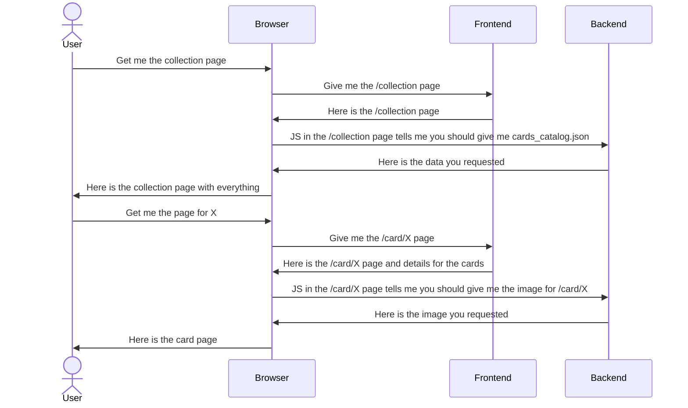

# Tome du Mage Noir

Ce document est une introduction au projet sur lequel vous etes.
Il est destiné à ceux qui souhaite améliorer le site (a venir) tdmn.espequair.eu, ou à ceux qui veulent réutiliser le code pour faire leur propre outillage.
 
## TODO
- [ ] Rendre regardable
  - [ ] Récupérer les logos des éléments
  - [ ] Afficher les images depuis un serveur
- [ ] Améliorer la page de carte
- [ ] Rendre Utile la page de collection
  - [ ] Ajouter "Grouper par"
  - [ ] Ajouter "Trier par"
  - [ ] Ajouter "Séléctionner par"
    - [ ]  "Type" - Radio
    - [ ]  "Nom"  - Texte
    - [ ]  "Mana Requis" - Texte pour chaque élément

## Fixes to do in the collection file
Il y a des incohérences mineures dans la façon dont les cartes sont enregistrés

|                | **Saison 1**       | **Saision 2**     |
|----------------|--------------------|-------------------|
| **Equipement** | [Equipement - Type](https://magenoir.com/collection/FR/air/Baguette_des_courants_d_air.html)  | [Equipement : Type](https://magenoir.com/collection/FR/air/Bottes-statiques.html) |
| **Permanents** | [Utilise PV](https://magenoir.com/collection/FR/vegetal/Arbre-mort.html) | [Utilise HP](https://magenoir.com/collection/FR/vegetal/Fleur-fractale.html)
        |
| **Noms**       | [En MAJUSCULES](https://magenoir.com/collection/FR/vegetal/Arbre-mort.html)      | [En minuscules]()     |

## SCRIPTS

Pour générer le json des cartes
En Python
do_everything() génère tout dans un dossier `worspace`, y compris 258Mb d'images

## BACKEND

Le moins développé pour l'instant.
Sera probablement Flask ou FastAPI, à voir
### Buts
- [ ] Servir les images
- [ ] Servir le fichier cards_catalog.json à jour

## FRONTEND

En Svelte+Sveltekit

## Organization

